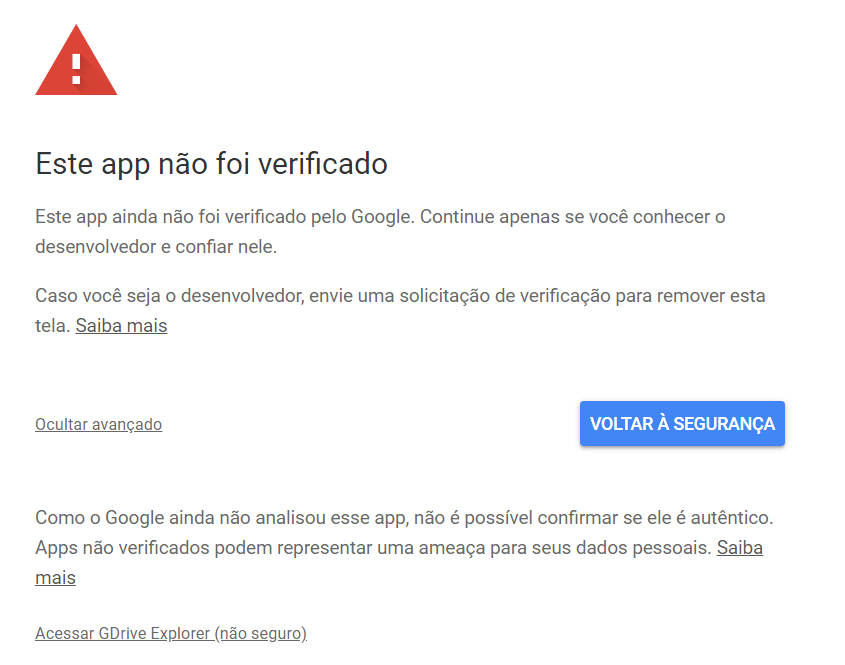
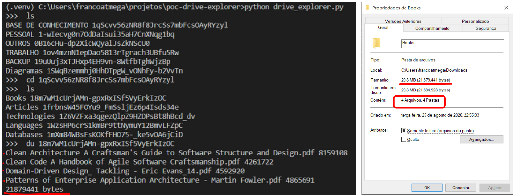

## Goals

Just write a PoC that can calculate Google Drive folder content, there's no native way to do that, there's some other options on internet,
but just for tedius sake I wrote this very simple solution and add some extra commands.

## To Do

1. Writing the functionalities of commands: `find`,` touch`, `cp`,` mv`, `down`,` up` and `share`.
2. Writing a decent command parser class that return all option in commands as objects.
3. Refactor the Google Drive authentication process.
4. Refactor ´ls` and `du` commands to accept the name of folder instead folder key.
5. A way to solve limitation problem described below.
6. Improvents in code comments ... lol.

## Limitations

Files created in Google Drive (ex: presentation files, text files) has no length until you download them on your machine,
so there's no way to calculate length of this files with `du` command and this can cause incorrect values ​​on output.
Maybe another library can do that ... This needs a little research.

## Observations

I don't have a app registered in Google API, so when authentication is required an error that my app is unverified will be prompted... 
As below:

*Generate your own [credentials](https://console.developers.google.com/iam-admin/projects) and replace `client_secrets.json` content and be happy. ;)

Just a sample working ...

